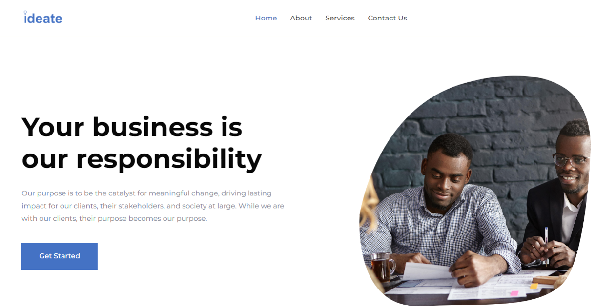

# Ideate



## Table of Contents
- [Ideate](#ideate)
  - [Table of Contents](#table-of-contents)
  - [Repo Details](#repo-details)
  - [About](#about)
  - [Purpose and Values](#purpose-and-values)
  - [How to Clone and Run the Site](#how-to-clone-and-run-the-site)

## Repo Details


## About


We are a dynamic team of highly motivated and intellectually agile professionals, fueled by an unwavering commitment to delivering transformative solutions that drive client success and contribute to positive societal change. We recognize that every client we serve wields a profound influence over their workforce, their industry, and the broader social fabric. We are genuinely excited about the opportunity to collaborate with our clients, harnessing our expertise to amplify their impact across all stakeholder spheres, catalyzing positive societal outcomes, and fostering a ripple effect of lasting change.

## Purpose and Values

At Ideate, our purpose is crystal clear: We are an agile cadre of forward-thinking professionals, driven by an unquenchable thirst for catalyzing transformative impact. Our mission is to empower clients to realize their potential as dynamic influencers in their industries and beyond. Through data-driven insights, innovative strategies, and unwavering dedication, we enable organizations to optimize their operations, achieve unprecedented growth, and lead by example in creating a better world. Our purpose is to be the catalyst for meaningful change, driving lasting impact for our clients, their stakeholders, and society at large. While we are with our clients, their purpose becomes our purpose.

## How to Clone and Run the Site
To clone and run the Ideate website in your browser, follow these steps:

1. **Clone the Repository:** Use Git to clone the repository to your local machine.

    ```bash
    git clone https://github.com/mr-vance/ideate.git
    ```

2. **Navigate to the Project Directory:** Change your current working directory to the project's root folder.

    ```bash
    cd ideate
    ```

3. **Open the HTML Files:** Open the HTML files in your preferred web browser:

    - `index.html` for the home page
    - `about.html` for the About Us page
    - `service.html` for the Services page
    - `contact.html` for the Contact page

You should now be able to view the Ideate website in your browser by opening the corresponding HTML files.

